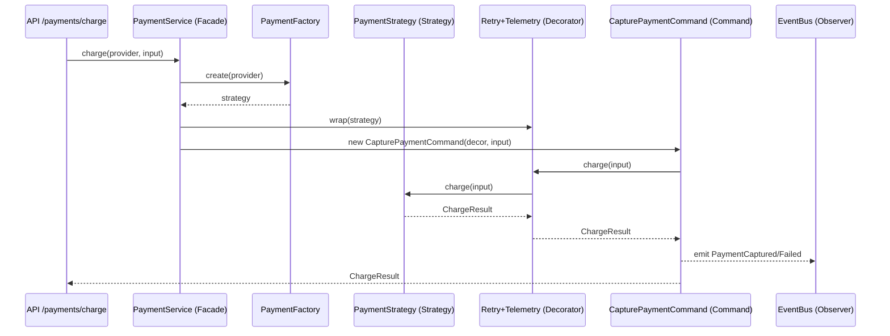

# 💳 Pasarela de Pagos Modular — Node.js + TypeScript

## 📘 Descripción General
Este proyecto implementa una **API modular de pagos** desarrollada en **Node.js y TypeScript**, diseñada para demostrar la aplicación práctica de **patrones de diseño de software** en un sistema realista.

La aplicación simula una **pasarela de pagos** que puede operar con diferentes proveedores (ej. Stripe, Mercado Pago), incluyendo manejo de **cobros, reembolsos y webhooks**.  
Está pensada como **proyecto académico para la materia _Metodología de los Sistemas II_**, aplicando principios de diseño, modularidad y mantenibilidad.

---

## 🎯 Objetivos del Proyecto
- Implementar múltiples **patrones de diseño** en un contexto real.
- Favorecer la **extensibilidad** al permitir agregar nuevos proveedores sin modificar la lógica existente.
- Desacoplar la lógica de negocio de la capa de presentación (API).
- Simular comportamientos de un sistema de pagos completo con **mock SDKs**.

---

## 🧩 Patrones de Diseño Aplicados

| Tipo | Patrón | Descripción |
|------|---------|-------------|
| **Creacional** | **Singleton** | Config y Logger centralizados, asegurando una única instancia global. |
|  | **Factory / Abstract Factory** | Crea la estrategia adecuada según el proveedor (`Stripe`, `MP`). |
| **Estructural** | **Adapter** | Unifica interfaces de SDKs externos heterogéneos (Stripe y Mercado Pago). |
|  | **Decorator** | Añade funcionalidad transversal (reintentos y telemetría) sin alterar el código base. |
|  | **Facade** | Simplifica el acceso a la lógica de negocio mediante `PaymentService`. |
| **Comportamiento** | **Command** | Encapsula operaciones (`Charge`, `Refund`) y las ejecuta de forma uniforme. |
|  | **Observer** | Permite suscribirse a eventos de dominio (p. ej. envío de notificaciones tras cobro). |
|  | **Strategy** | Define algoritmos alternativos de cobro y reembolso según el proveedor. |

---

## 🏗️ Estructura del Proyecto

```
root/
├── src/
│ ├── api/           # Rutas Express
│ ├── config/        # Singleton Config
│ ├── core/
│ │ ├── commands/     # Command Pattern
│ │ ├── events/       # EventBus (Observer)
│ │ ├── payments/
│ │ │ ├── adapters/   # Adapter Pattern
│ │ │ ├── strategies/ # Strategy Pattern
│ │ │ ├── factories/  # Factory Pattern
│ │ │ ├── decorators/ # Decorator Pattern
│ │ │ ├── facade/     # Facade Pattern
│ │ │ └── PaymentTypes.ts
│ ├── infra/          # Logger Singleton
| |── schemas/
│ ├── tests/          # Tests con Vitest + Supertest
│ └── app.ts          # Bootstrap de la API
├── package.json
├── tsconfig.json
└── README.md
```

## ⚙️ Instalación y Uso

### 1. Clonar e instalar dependencias
```bash
git clone esteREPO
cd root
npm install
```
### 2. Ejecutar en modo desarrollo

```bash
npm run dev
```
La API se levantará por defecto en:
📍 http://localhost:3000

### 3. Compilar y ejecutar

```bash
npm run build
npm start
npm run build
npm start
```

### 4. Ejecutar tests

```bash
npm run test
npm run test:coverage
```

## 🌐 Endpoints Principales

Probar con __Postman__ o __curl__

|Método|	Ruta|	Descripción|
|------|-----|------|
|POST	|/payments/charge |	Realiza un cobro con el proveedor indicado.|
POST	|/payments/refund|	Ejecuta un reembolso de un pago.|
POST |	/webhooks/:provider|	Recibe notificaciones (mock) de proveedores externos.|

### Ejemplo de cobro
```bash
curl -X POST http://localhost:3000/payments/charge \
  -H "Content-Type: application/json" \
  -d '{"provider":"stripe","amount":2500,"currency":"ARS","token":"tok_test"}'
```
### Ejemplo de reembolso

```bash
curl -X POST http://localhost:3000/payments/refund \
  -H "Content-Type: application/json" \
  -d '{"provider":"mp","paymentId":"mp_abc123","amount":1000}'
```

## 🔍 Flujo interno de ejecución


----
## 🧠 Beneficios del Diseño

- **Extensible**: agregar un nuevo gateway solo requiere una nueva Strategy y Adapter.

- **Desacoplado**: la API no conoce detalles internos del proveedor.

- **Reutilizable**: los comandos pueden orquestarse o ejecutarse desde colas.

- **Testable**: cada componente se prueba de forma aislada con mocks.

- **Escalable**: los patrones Decorator y Observer permiten incorporar métricas, auditorías o eventos sin modificar la lógica base.